# Introduction

The problem is that batch effect is assumed to affect gene expression on an individual gene level.  In other words, we typically use adjustments, such as empirical bayes to control.

Consider a set of samples from a study involving two batches.
Let the expression data be distributed as a set of MVN with mean vector $\mu$ and covariance structure $\Sigma$.

Existing batch correction methods are designed to identify differentially expressed genes and thus focus on $\mu$ and the diagonal of $\Sigma$.

For network inference, however, we are less interested in these values and more interesting in the off-diagonal of $\Sigma$.  Mechanisms for batch effect which act on the covariance structure rather than the mean and variance structure will not be corrected for using existing batch correction methods.

```{r}
library(sva)
library(MASS)
library(ggplot2)
library(limma)
numSamples <- 1000
gene1 <- c(rnorm( numSamples,7),rnorm(numSamples,9))
gene2 <- c(rnorm(numSamples,7),rnorm(numSamples,9))
batch <- c(rep("A",numSamples),rep("B",numSamples))

df <- data.frame(gene1,gene2,batch)

ggplot(df, aes(x=gene1,y=gene2)) +geom_point(aes(col=batch),size=3, alpha=.5) +ggtitle("Raw data") +theme_bw() 
correct <- c(rep(0,numSamples),rep(2,numSamples))
bc <- data.frame(gene1=gene1-correct,gene2=gene2-correct,batch)

ggplot(bc, aes(x=gene1,y=gene2)) +geom_point(aes(col=batch),size=3, alpha=.5) +ggtitle("Batch corrected data") +theme_bw() 

```

This is batch correction working as intended.

But what if we can't (won't) assume that batch only affects mean and variance, but also impacts covariance?  This is critical for Network inference.

```{r, cache=TRUE}

genes <- mvrnorm(n = numSamples, c(7,7), matrix(c(1,.95,.95,1),nrow=2), tol = 1e-6, empirical = FALSE, EISPACK = FALSE)
gene1 <- c(genes[,1],rnorm(numSamples,9))
gene2 <- c(genes[,2],rnorm(numSamples,9))

df2 <- data.frame(gene1=gene1,gene2=gene2,batch)
ggplot(df2, aes(x=gene1,y=gene2)) +geom_point(aes(col=batch),size=3, alpha=.5) +ggtitle("Raw data") +theme_bw() 

df2 <- data.frame(gene1=gene1-correct,gene2=gene2-correct,batch)
ggplot(df2, aes(x=gene1,y=gene2)) +geom_point(aes(col=batch),size=3, alpha=.5) +ggtitle("Batch corrected data") +theme_bw() 

```

Existing methods do not address this "2nd order batch effect"

```{r, cache=TRUE}
numGenes <- 1000
nBatch1 <- numSamples
nBatch2 <- numSamples
mvnMean1  <- rexp(numGenes)
mvnMean2  <- rexp(numGenes)
mvnSigma1 <- 30*diag(rexp(numGenes))
mvnSigma2 <- 30*diag(rexp(numGenes))
batchCovariates <- c(rep("A",nBatch1),rep("B",nBatch2))

data1 <- t(mvrnorm(n = nBatch1, mvnMean1, mvnSigma1, tol = 1e-6, empirical = FALSE, EISPACK = FALSE))
data2 <- t(mvrnorm(n = nBatch2, mvnMean2, mvnSigma2, tol = 1e-6, empirical = FALSE, EISPACK = FALSE))
data <- cbind(data1,data2)


design <- model.matrix(~factor(batchCovariates))
diffExp <- ebayes(lmFit(data, design))
limmaPVals <- diffExp$p.value[,2]

qplot(-log(1:numGenes/numGenes),-log(sort(limmaPVals))) + geom_abline(intercept=0,slope=1) +
    ggtitle("QQ plot for uncorrected batched expression data") + xlab("-log(Expected)") + ylab("-log(Observed)") #+

combatData <- ComBat(data, batchCovariates, prior.plots=T)
combatDiffExp <- ebayes(lmFit(combatData, design))
combatLimmaPVals <- combatDiffExp$p.value[,2]

qplot(-log(1:numGenes/numGenes),-log(sort(combatLimmaPVals))) + geom_abline(intercept=0,slope=1) +
    ggtitle("QQ plot for batched expression data") + xlab("-log(Expected)") + ylab("-log(Observed)")

```

So, in this example, we see that use of empirical Bayes correction allows for the control of false positives in differential expression analysis.  Does it also control false positives in network inference?

```{r, cache=TRUE}
library(nettools)
wgcna <- mat2adj(t(data),method="WGCNA")
allR <- wgcna[row(wgcna)>col(wgcna)]
tStats <- sort((allR^(1/6))*sqrt(ncol(data)-2))

qplot(sort(abs(qt(1:length(tStats)/length(tStats),df=98))), tStats)  + geom_abline(intercept=0,slope=1) +
    ggtitle("QQ plot for raw data WGCNA") + xlab("-log(Expected)") + ylab("-log(Observed)")


```

We see that batch effect clearly leads to false positives in the absence of correction

```{r, cache=TRUE}
combatwgcna <- mat2adj(t(combatData),method="WGCNA")
allR <- combatwgcna[row(combatwgcna)>col(combatwgcna)]
tStats <- sort((allR^(1/6))*sqrt(ncol(combatData)-2))

qplot(sort(abs(qt(1:length(tStats)/length(tStats),df=98))), tStats)  + geom_abline(intercept=0,slope=1) +
    ggtitle("QQ plot for corrected data WGCNA") + xlab("-log(Expected)") + ylab("-log(Observed)")
```

The use of Combat does a good job of limiting false positives in this simple case.

But...
What if the batch effect impacts the covariance structure rather than the mean structure?

```{r, cache=TRUE}
SigmaVec <- rep(0,numGenes^2)
SigmaVec[sample(numGenes^2,10000)] <- rbeta(10000,1,3)
mvnSigma1 <- matrix(SigmaVec, ncol=numGenes)
mvnSigma1 <- mvnSigma1 + t(mvnSigma1)

SigmaVec <- rep(0,numGenes^2)
SigmaVec[sample(numGenes^2,10000)] <- rbeta(10000,1,3)
mvnSigma2 <- matrix(SigmaVec, ncol=numGenes)
mvnSigma2 <- mvnSigma2 + t(mvnSigma2)


mvnMean1  <- rexp(numGenes)
mvnMean2  <- rexp(numGenes)
diag(mvnSigma1) <- colSums(mvnSigma1)
diag(mvnSigma2) <- colSums(mvnSigma2)
batchCovariates <- c(rep("A",nBatch1),rep("B",nBatch2))

data1 <- t(mvrnorm(n = nBatch1, mvnMean1, mvnSigma1, tol = 1e-6, empirical = FALSE, EISPACK = FALSE))
data2 <- t(mvrnorm(n = nBatch2, mvnMean2, mvnSigma2, tol = 1e-6, empirical = FALSE, EISPACK = FALSE))
data <- cbind(data1,data2)


design <- model.matrix(~factor(batchCovariates))
diffExp <- ebayes(lmFit(data, design))
limmaPVals <- diffExp$p.value[,2]

qplot(-log(1:numGenes/numGenes),-log(sort(limmaPVals))) + geom_abline(intercept=0,slope=1) +
    ggtitle("QQ plot for uncorrected correlation-batched expression data") + xlab("-log(Expected)") + ylab("-log(Observed)") #+

combatData <- ComBat(data, batchCovariates, prior.plots=T)
combatDiffExp <- ebayes(lmFit(combatData, design))
combatLimmaPVals <- combatDiffExp$p.value[,2]

qplot(-log(1:numGenes/numGenes),-log(sort(combatLimmaPVals))) + geom_abline(intercept=0,slope=1) +
    ggtitle("QQ plot for corrected correlation-batched expression data") + xlab("-log(Expected)") + ylab("-log(Observed)")

```

Again, for differential expression, we see that conventional batch correction methods do a satisfactory job controlling the false positives.

Now we look at how "2nd order batch effects" affect network inference.

```{r, cache=TRUE}

datawgcna <- mat2adj(t(data),method="WGCNA")
allR <- datawgcna[row(datawgcna)>col(datawgcna)]
tStats <- sort((allR^(1/6))*sqrt(ncol(data)-2))

qplot(sort(abs(qt(1:length(tStats)/length(tStats),df=98))), tStats)  + geom_abline(intercept=0,slope=1) +
    ggtitle("QQ plot for corrected correlation-batched data WGCNA") + xlab("-log(Expected)") + ylab("-log(Observed)")
```

***

# Batch effect in published NI studies

* GTEx uses WGCNA to find common modules across tissues.

* GTEx Consortium attempted to adjust for batch in the following ways

Study design:

> To the extent possible, based on sample availability, batches
for library construction were designed to include a range of samples from different tissues and to
span multiple donors, so as to minimise donor and tissue batch effects.

Expression correction:

> the effect of top 3 PEER factors, gender, and 3 genotype PCs were removed.

Neither of these address the "second order" batch issue.

# Results

## Demonstrate that different results would have been obtained by accounting for "second order" batch effects.

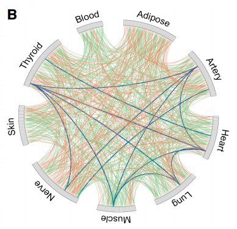

## Process
1. Choose two tissue types (Blood and Lung)
2. Apply batch correction.
3. Run WGCNA on each tissue
4. Compute modules based on TOM

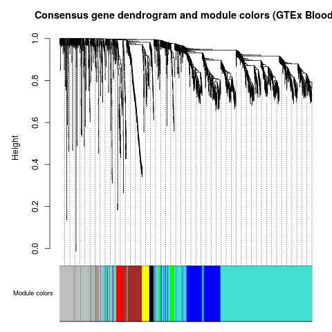
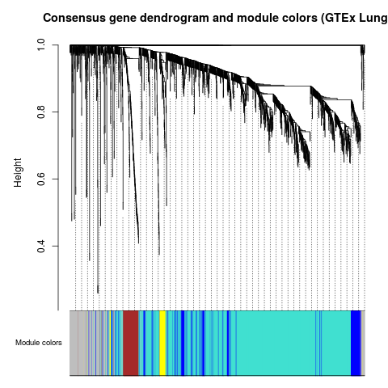

5. Compute overlap and significance
6. Plot edges between modules

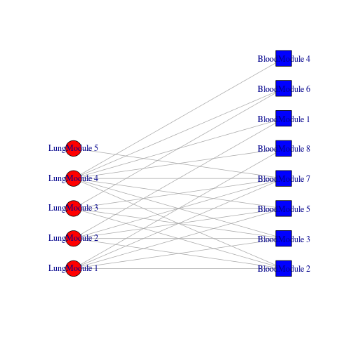

7. Run separately on only one batch (Center)

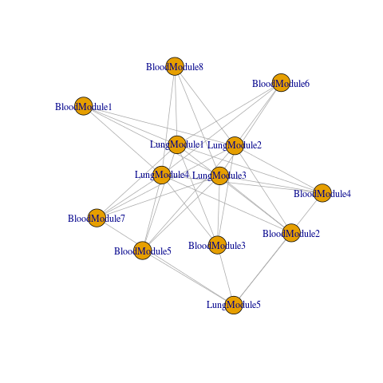 Center A
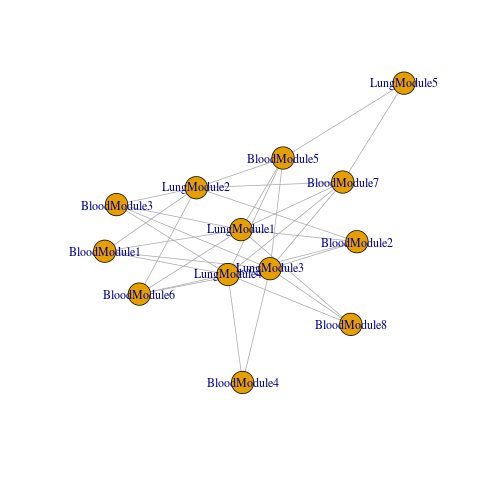 Center B
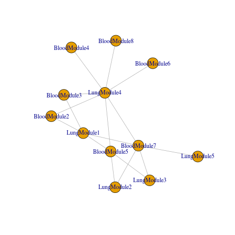 Center C


## 2nd Order Batch Effect Correction - Solution:  
Conventional batch correction model:
$$Y_g=\alpha_g+\beta_gX+\gamma_igZ+\delta_ig\epsilon_ig$$

where X is the exposure (e.g. treatment/control) and Z is the batch (or other covariates).
In the context of network inference, we often want to find $cor(Y_{g1},Y_{g2})$, independent of $Z$.  

So, in order to model 2nd order batch, what we really want to do is allow for the parameter of interest, $\beta_g$ to vary by batch.  
So, now we set

$$\beta_g^*=\beta_g+\beta_BgZ$$

Where $\beta_B$ is a new parameter that we need to estimate for each of the ${{p}\choose{2}}$ comparisons.

We can write out a full model for any two genes.  Note that $Y_{g2}$ is another gene in this model.

$$Y_{g2}=\alpha_g+\beta_g^*X+\gamma_igZ+\delta_ig\epsilon_ig$$

or

$$Y_{g2}=\alpha_g+(\beta_g+\beta_BgZ)X+\gamma_igZ+\delta_ig\epsilon_ig$$
$$Y_{g2}=\alpha_g+\beta_gX+\beta_BgZX+\gamma_igZ+\delta_ig\epsilon_ig$$

There are many ways to approach this, but I believe the best way is the following steps:

1. Apply conventional batch correction.  This will effectively eliminate the $\gamma_igZ$ term and we can proceed with the simpler model - $$Y_{g2}=\alpha_g+\beta_gX+\beta_BZX+\delta_ig\epsilon_ig$$ - on the combat-corrected data.  Further standardize each gene expression (this will not impact the actual results, but will aid in interpretation and computation time)

2. Fit the following models 
Reduced: $$Y_{g2}=\alpha_g+\beta_gX+\delta_ig\epsilon_ig$$
Full: $$Y_{g2}=\alpha_g+\beta_gX+\beta_BZX+\delta_ig\epsilon_ig$$

3. Place estimated coefficients into two separate matrices ($S_\beta,S_B$).  We have tons of options for computing these coefficients.  A LASSO-style L1 regularization would probably make the most sense here, but for the purposes of simplicity we will start with OLS.

So, now we have two separate (equal sized) matrices instead of the usual one. $S_\beta$ is the estimated similarity matrix and $S_B$ is the "batch impact".  Intuitively, we can imagine that the expected value of $S_B$ is a zero matrix in the absence of 2nd order batch effects.  This lends itself easily for 2nd order batch effect testing - for example, we can compare the two models via likelihood ratio test (LRT).  This is nice, but we're much more interested in 2nd order batch effect *correction*.

4. Compute the corrected similarity matrix via:
$$\hat{S_i^*}=\hat{S_\beta}+(\frac{\sum_{j \in{X_i}}Z_j}{n_i})\hat{S_B} $$

## What this means
This yields a similarity matrix that is **batch-independent**.  In other words, we can now compare networks computed with different proportions of batch membership.  We can think of the adjusted similarity matrix as being the estimated similarity matrix given a *standardized representation of batches*.  This standardization allows us to compare networks which have been inferred with differing batch composition.

Obviously, the usual caveats apply - this correction is most useful when the batches in each exposure are (a) unequal, (b) not too unequal.  Small numbers of samples for batches will result in wild fluctations in terms of estimating batch effect.

##  Trying out the new implemented method on adjusted subset of the ECLIPSE data.

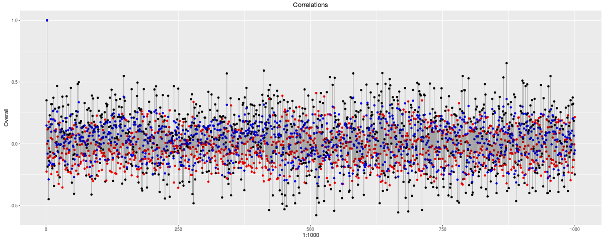 Gene 1 (BLUE=naive, BLACK=Batch_baseline, RED=Batch_difference)

***

## An validation approach
Given the difficulties of validating networks, validation that batch has been properly controlled will be a challenge.
Rather than compare our results to an unreliable, expensive, or non-existent gold-standard benchmark we can instead focus on the network "stability".  In theory, our approach should control for batch and thus be independent of the batch distribution.  We can examine this by sampling differing proportions from batches and observing the tendency to vary as a function of the batch proportion.

This approach uses the following procedure for a set of $n$ total samples from two distinct batches:

1. Infer an overall network, $G$, from the entire dataset, $n$ samples, using standard methods for batch correction.
2. Choose some $n^*$, $n^*<n$, to be the subsetted sample size. A reasonable value for $n^*$ would be something like $.5n$
3. Choose a sequence $s$, to represent a set of batch proportions over which we will sample unbalanced batches.  So, for example, $s$={.10,.11,.12, ..., .90}
4. For each $s_i\in s$, sample with replacement $n^*$ individuals, such that $s_i$ is the proportion of samples from Batch A (and $1-s_i$ is the proportion belonging to Batch B).  For completeness, this step can be performed many times for each $s_i$
5. Infer a network, $H_i$, for each $s_i$.
6. Compute the AUC-ROC for each $H_i$ using the full network $G$ as the benchmark.

The above procedure is performed for both standard uncorrected network inference and also for our corrected version.

## Generating a dataset with known batch effect
2nd order batch effect in GTEx clearly exists (see above), but it can be subtle.  For the purposes of a proof on concept, we can generate a much stronger batch effect which clearly demonstrates this approach.
We simply select 5000 genes and 5000 separate genes in the other batch, relabelling them Gene1, Gene2,...,Gene5000.  Basically, we're simply mismatching the genes between the batches!  This, obviously, causes a completely random rewiring of the network from one batch to the other.

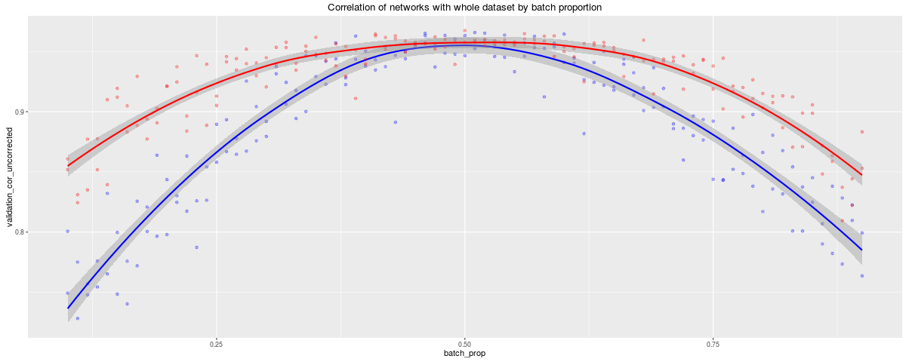

Benchmark taken as the set of edges>.1, which is roughly 38% of all edges

## Running analysis on real data - GTEx
Confounder used -  EBV-transformed lymphocytes vs Whole Blood
This data is comprised of 245 sample, 54 cell lines and 191 Whole Blood, processed via Joe Paulson.
There are 24369 genes, but I subsetted 2000 genes by highest variance (just to reduce computational burden)

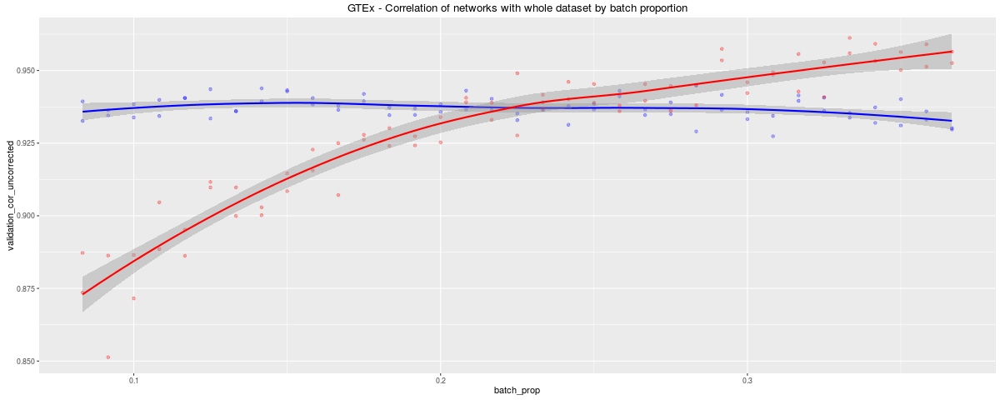

Benchmark taken as the set of edges>.1, which is roughly 44% of all edges


## Model adjustments
This allows us to evaluate the performance of model tweaking alterations.
We can impose sparsity constraints, shrinkage or some bayesian prior on the magnitude of the batch effect.

Work in progress - 

1. Design model to impose sparsity on *differential correlation*.  L1 and L2 regularization 
2. Empirical Bayes approach to address small sample issues (the left part of above plot)

## Real data demonstration of impact of 2nd order confounding

Used Eclipse data.  

Summary:
In this analysis, we will perform a very common analysis: 
Build coexpression networks based on **COPD** vs **Smoker control** and identify consensus modules with WGCNA.
**Gender** is treated as a confounder, but is only corrected using standard batch correction methods...


```{r, cache=TRUE}
eclipseExp <- read.table("~/gd/Harvard/Research/data/Eclipse/ECLIPSE_Blood_Exp.txt",row.names=1,header=T)
eclipseClinical <- read.table("~/gd/Harvard/Research/data/Eclipse/ECLIPSE_blood.txt",header=T,fill = TRUE, sep="\t",row.names=1)
```

Data: `r length(eclipseClinical$Gender)` samples with `r sum(eclipseClinical$Gender=='M')` males and `r length(eclipseClinical$Gender=='F')` females. 
`r sum(eclipseClinical$Subject.type=="COPD")` COPD and `r length(eclipseClinical$Subject.type=="Smoker Control")` Smoker Controls

```{r, cache=TRUE}
table(eclipseClinical$Subject.type,eclipseClinical$Gender)[c(1,3),]
```

1. Run ComBat on gene expression data, *including gender as a covariate*.
2. Sample a set of designs from this study which include varying degrees of gender imbalance.
3. Evaluate the agreement between cases and controls with pseudo-R^2 from multinomial logisitic regression (can use MCC or any other method here).
4. Determine the degree to which the agreement between cases and controls depends on the gender distribution.

While this data is reasonably balanced, we can use it to demonstrate how sensitive our results are to confounding that was *supposedly* accounted for already.


```{r, eval=F}

cases <- eclipseClinical$Subject.type=="COPD" 
controls <- eclipseClinical$Subject.type=="Smoker Control" 

males <- eclipseClinical$Gender=="M" 

# dataA <- eclipseExp[10101:12100,c(T,F)]
# dataB <- eclipseExp[10101:12100,c(F,T,F,F)]

dataA <- eclipseExp[101:2100, cases&(!males)]
dataB <- eclipseExp[101:2100, controls&(males)]

fixedDataA <- fixDataStructure(t(dataA))
fixedDataB <- fixDataStructure(t(dataB))


fixedDataA_BCM <- blockwiseConsensusModules(fixedDataA, power = 6, minModuleSize = 30, deepSplit = 2, maxBlockSize=30000,
                                      pamRespectsDendro = FALSE, 
                                      mergeCutHeight = 0.25, numericLabels = TRUE,
                                      minKMEtoStay = 0,
                                      saveTOMs = TRUE, verbose = 5)
# adjMat <- adjacency(t(dataA), power = 6)
# TOM <- TOMsimilarity(adjMat, TOMDenom = 'min', verbose = 1)
# consensusNetwork <- consensusDissTOMandTree(fixedDataA, 6, TOM = TOM)

fixedDataB_BCM <- blockwiseConsensusModules(fixedDataB, power = 6, minModuleSize = 30, deepSplit = 2, maxBlockSize=30000,
                                     pamRespectsDendro = FALSE, 
                                     mergeCutHeight = 0.25, numericLabels = TRUE,
                                     minKMEtoStay = 0,
                                     saveTOMs = TRUE, verbose = 5)
# summary(lm(fixedDataA_BCM$colors==0 ~ as.factor(fixedDataB_BCM$colors)))

# vglmFitMN <- vglm(as.factor(lungBCM$colors) ~ sample(as.factor(bloodBCM$colors)), family=multinomial(refLevel=1))

# pseudo-R^2
pseudoMultiR <- function(groupsA, groupsB, method="nagelkerke"){
    require(VGAM)
    vglmFitMN <- vglm(as.factor(groupsA) ~ as.factor(groupsB), family=multinomial(refLevel=1))
    vglm0 <- vglm(as.factor(groupsA) ~ 1, family=multinomial(refLevel=1))
    LLf   <- VGAM::logLik(vglmFitMN)
    LL0   <- VGAM::logLik(vglm0)
    N <- length(groupsA)
    if(method=="mcfadden"){
        as.vector(1 - (LLf / LL0))
    } else if (method=="coxsnell"){
        as.vector(1 - exp((2/N) * (LL0 - LLf)))
    } else if (method=="nagelkerke"){
        as.vector((1 - exp((2/N) * (LL0 - LLf))) / (1 - exp(LL0)^(2/N)))
    }
}
```

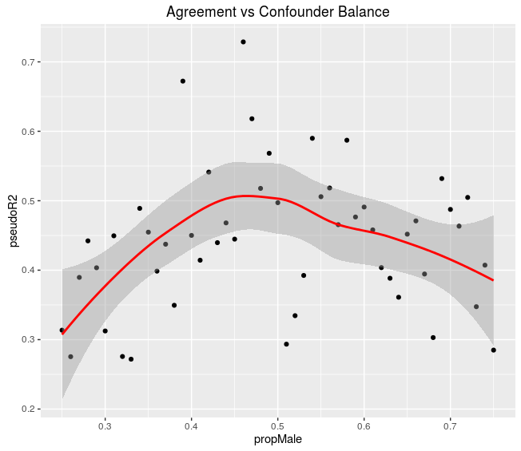

This is great!  Very clear dependence of agreement between cases and control on the *balance*.  In other words, with a strong lack of balance, we see weaker agreement, indicating that the results we DO see are a function of the confounder and not the case-control partition.

And now the ~~bad~~ **less awesome** news...

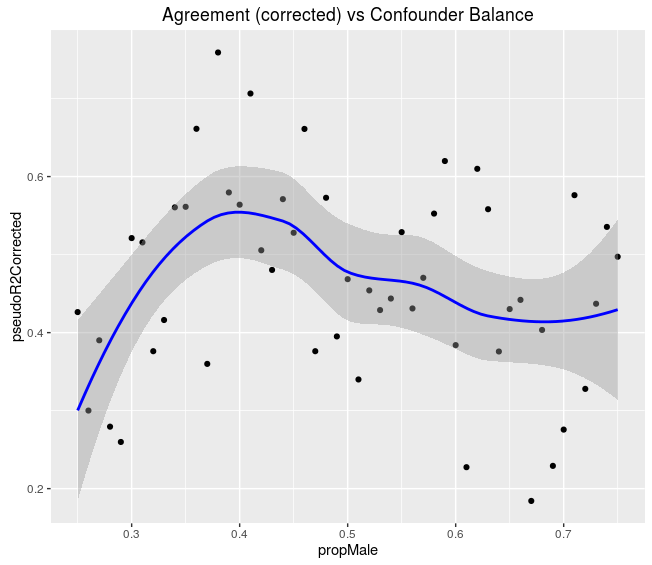

Current correction implementation does not appear to help the cause at the moment.

### Why not??

**Likely reason #1**:

Approach is too flexible for 2nd order effects.  

Solutions:

* Argue that our finding that 2nd order batch effect exists is interesting on it's own.
* Demonstrate that our method works in large (possibly very large) samples.
* We need stronger assumptions, such as sparsity, to make it more resistant to overfitting 2nd order batch effects.

**Likely reason #2**:
2nd order effects are not as strong as they are in the demo above (Reminder: we used a *completely* different network for Batch A compared to Batch B)

Solutions:

* Again, incorporating sparsity into the algorithm may work here as it is may be reasonable in more realistic data to assume that networks vary very very little between batches and most edges have difference equal to zero.

## WGCNA
library(WGCNA)

dissTOMCases=TOMdist(abs(cor(t(dataset$exp[c(T,F),casesFilter]),use="p"))^6)
dissTOMControls=TOMdist(abs(cor(t(dataset$exp[c(T,F),controlsFilter]),use="p"))^6)
copdgeneDif <- dissTOMCases-dissTOMControls
rownames(copdgeneDif) <- rownames(dataset$exp)[c(T,F)]
colnames(copdgeneDif) <- rownames(dataset$exp)[c(T,F)]

load("~/NI_only_0001/ECLIPSE_JASPAR2014_MONSTER.RData")

dissTOMCases=TOMdist(abs(cor(t(dataset$exp[c(T,F),casesFilter]),use="p"))^6)
dissTOMControls=TOMdist(abs(cor(t(dataset$exp[c(T,F),controlsFilter]),use="p"))^6)
eclipseDif <- dissTOMCases-dissTOMControls
rownames(eclipseDif) <- rownames(dataset$exp)[c(T,F)]
colnames(eclipseDif) <- rownames(dataset$exp)[c(T,F)]

intersectGenes <- intersect(rownames(eclipseDif),rownames(copdgeneDif))
eclipseDif <- eclipseDif[intersectGenes,intersectGenes]
copdgeneDif <- copdgeneDif[intersectGenes,intersectGenes]


library(ggplot2)
df <- data.frame(copdgene=c(copdgeneDif[1:100,1:100]),eclipse=c(eclipseDif[1:100,1:100]))
ggplot(df,aes(x=copdgene,y=eclipse)) + geom_point(alpha=.1) + theme_bw() + theme(panel.grid.major = element_blank(), panel.grid.minor = element_blank())


## An approach that is probably not going to be sufficient (Regularized implementation)

Model:
let $X$ be our gene expression matrix, containing $p$ rows and $n$ columns, corresponding to genes and samples, respectively.

and so let $X_{g1},X_{g2}$ be two genes within that matrix

and let $Z$ be a covariate on which we want to apply batch correction.


Combat batch correction and standard normalization methods are first applied.  Next each row is standardized, such that
$$\bar{X}_{g1} = \bar{X}_{g2}=0$$

We can fit the model:

$$X_{g2}=\beta_0+\beta_1X_{g1}+\beta_2Z + \epsilon_{g2}$$

And then immediately ignore the intercept term (because of the standardization)

So we have:


$$E[X_{g2}]=\beta_{1,g1,g2}X_{g1}+\beta_{2,g1,g2}Z$$

for 

$$g1,g2\in {1,2,...p}$$

with constraints

$$\sum_{i=1}^{p}\sum_{j=i+1}^{p}\beta_{2,i,j}^2<\lambda$$

We impose no such restriction on the $\beta_1$s

Each one individually can be solved via
$$X^*=rbind(cbind(X,Z),matrix(0,\lambda,\lambda,0)$$
$$(X_{g1}^{*T}X_{g1}^*)^{-1}X_{g1}^{*T}X_{g2}$$

But this is completely unfeasible at high throughput scale, where we want computing ${n \choose 2}$ models.

I developed a workaround which involves involves computing the hat matrix for each gene separately, storing those $p$ matrices and computing the associations from there.  This requires *a lot* of memory - since we are storing *p\*n^2* values, but also allows the algorithm to run approximately asymptotically $p/2$ times faster.

**However, this may be moot**, as I have discovered that the sparsity constraint may not be the best idea.  Here's why:

*L2* regularization shrinks all estimates toward zero.  However, for any constraint, we basically "allow" a certain amount of batch to be estimated.  This will result in a similar amound of batch to be controlled for in all scenarios, regardless as to whether batch *actually* exists in the data (bad!).  We will be overfitting too much batch and it will be very hard to identify when we are doing it.

## Better ideas:
* Assign some bayesian prior.  Compute the results without penalty and apply a bayesian prior to estimate the posterior batch effect.  This is an inelegant solution and I would prefer a different approach if I can design a superior one.
* Use adjacent information in penalizing.  If Gene A is batch correlated with Gene B and Gene B is batch correlated with Gene C, then we should be more willing to believe that Gene A and Gene C are batch correlated.  In other words, it would be great to relax penalties based on common coexpression.  From last meeting, we decided to explore the idea of using metagenes from PCA...

Inverting a $20,000\times 20,000$ matrix is also not a practical approach (but within reason on cluster).  I will table this approach until I cannot come up with another...


## Progress
Controlling for confounding in network inference.
Substantial progress has been made in this project in the following areas:

1. Developing a theoretical framework
2. Demonstrating problems in existing published analyses
3. Developing a method for addressing
4. Demonstrating method's efficacy in simulated data
5. Demonstrating method's efficacy in real data with simulated batch


## Manuscript outline

1. Introduction (description of existing methods and why they don't address higher order effects).
2. Presentation of framework (theory).
3. Demonstration of problems in simulations (Using true network structure, we show that results are sensitive to batch proportions).
4. Demonstration of problems in existing literature (Using ENCODE data, we show that results are sensitive to batch proportions).
5. Describe method for addressing batch effect 
6. Demonstrate that our method outperforms naive approach in *in silico* data.  We have plots to show that our error is higher when batches are uneven, or we can simply use the usual ROC curve.  Since we have the true network structure, ROC curves are probably best.
7. **Demonstrate that our method outperforms naive approach in ENCODE data.  We have plots to show that our error is higher when batches are uneven.  We can probably improve on this plot.**
8. Conclusion & Discussion


Initial analyses have proved challenging to demonstrate in real data with real batch, 